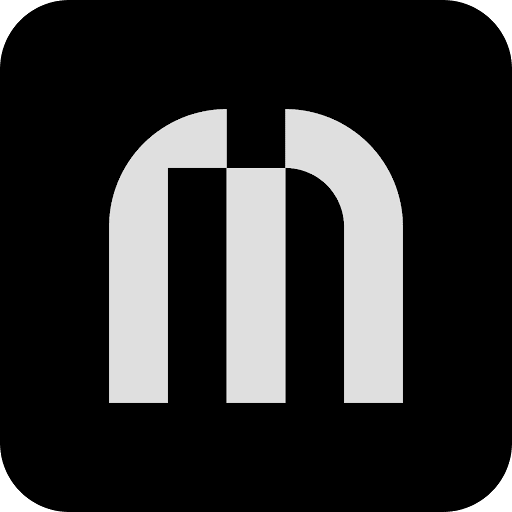
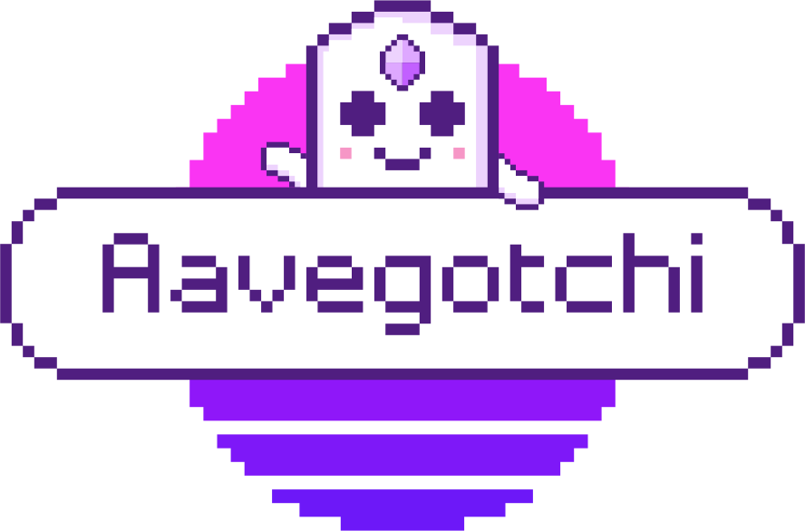

# 🪄 NFTs

## Luchadores

Luchadores.io is a 100% on-chain auto battler NFT project. Luchadores are designed to exist forever on the Ethereum blockchain with 100% onchain art + metadata, unlike many projects whose data is store on centralised servers.

This is where my profile picture comes from ! I own the [Luchador 2998](https://luchadores.io/luchador/2998).

<figure><figcaption></figcaption></figure>

I have also created a bot for the Luchadores.io collection. My bot periodically fetches price from OpenSea and display it on my Discord server.

## Ledger Market Pass

The \[ Ledger ] Market Pass — Genesis Edition is an NFT that includes access to exclusive collaborations, limited edition hardware, and more. It was created by the well known hardware wallet manufacturer Ledger.

<figure><figcaption></figcaption></figure>

## AAVEGotchi

Aavegotchis are ERC721 NFTs represented by onchain SVG layers. Each Aavegotchi manages an escrow contract address that holds aTokens, interest-generating ERC20 tokens from the Aave protocol.

<figure><figcaption></figcaption></figure>
